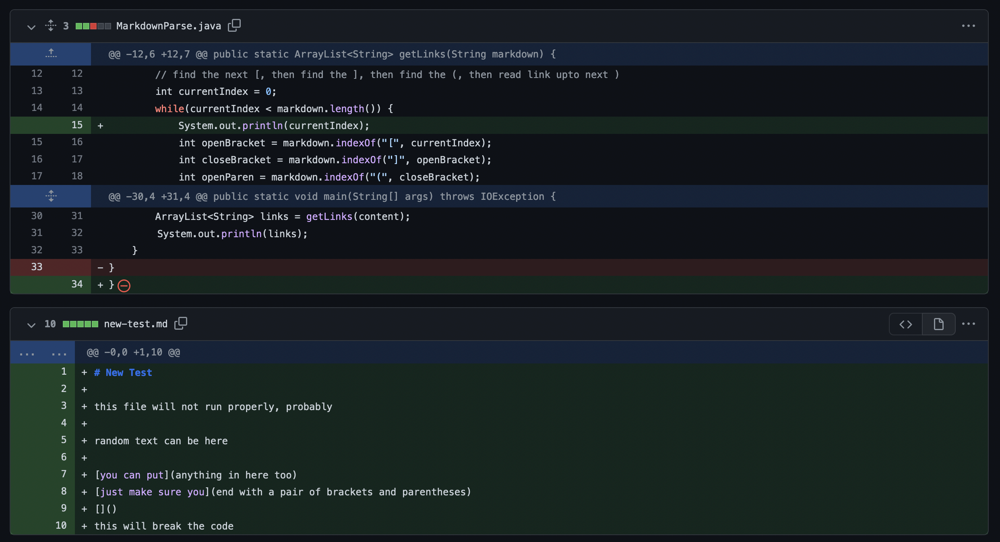
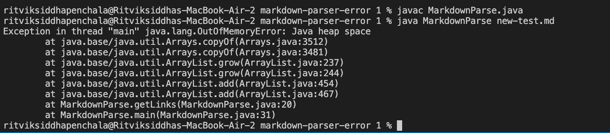
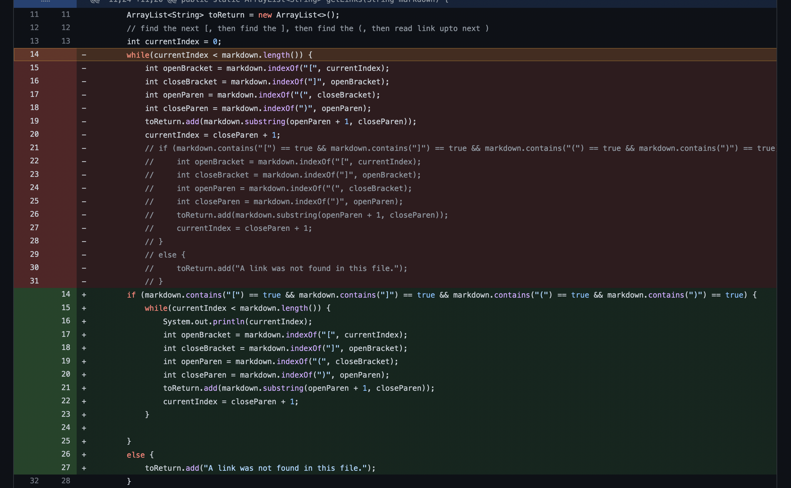
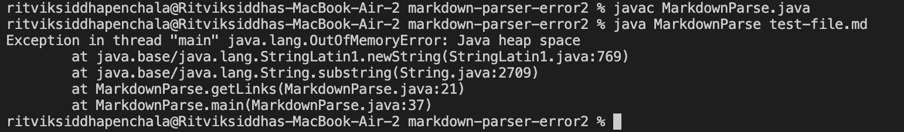
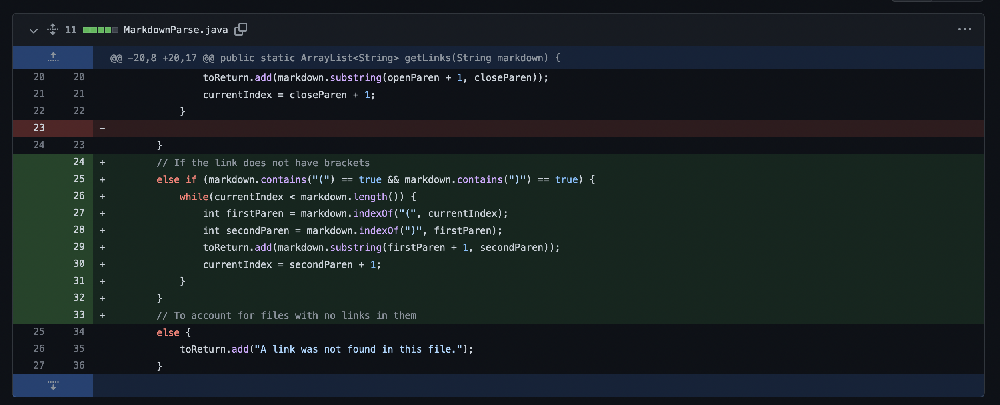
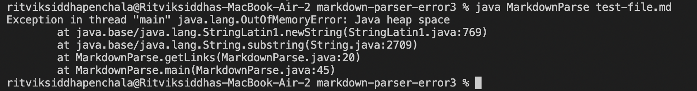

# **Lab Report 2**

___

## Bug #1 

Here are the changes made to the code

[Link to Error-Inducing File](https://github.com/ritvikpen/markdown-parser/blob/e2275d39927fb325210863f01b3e9801f334d024/test-file.md)

Here is what the terminal output looks like

The reason that this error occurs is because there is no "final link" in the test file. The code continues to keep checking for an opening and closing parentheses within the text file even though it does not exist. The code expects the test file to end with a ")".

___

## Bug #2

Here are the changes made to the code

[Link to Error-Inducing File](https://github.com/aHewig/markdown-parser/blob/32bebb5ec755b522646e7d526a6aa91e87da34ac/test-file.md)

Here is what the terminal output looks like

This code update allows us to input files that have no links in them at all. This means we can input a file with just text and the code will not crash. However, it still fails when we have an empty line after the link (as we can see in our terminal output). The code continues to look for a final file when there exists none, so it is stuck in an infinite loop and crashes.

___

## Bug #3

Here are the changes made to the code

[Link to Error-Inducing File](https://github.com/aHewig/markdown-parser/blob/61d7e14e5f570ee10983a56363579655be25af0f/test-file.md)

Here is what the terminal output looks like

This code uses a very different approach to detecting the links, but it still fails to the same test case. When there is an empty line at the end of the file, the code will still crash. This is because, although the code looks for links in a uniqe way, it still constantly looks for links and struggles when it cannot find a final link at the end of the file.