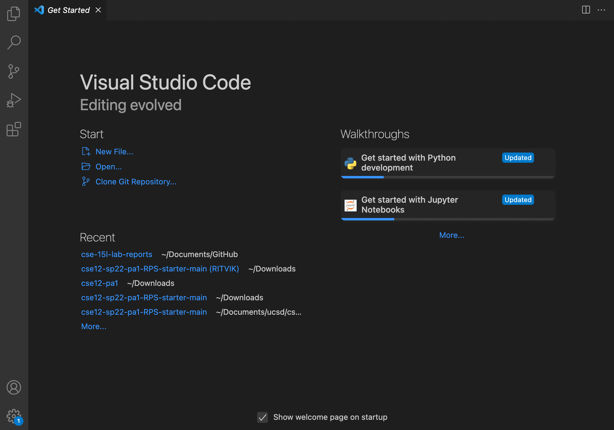
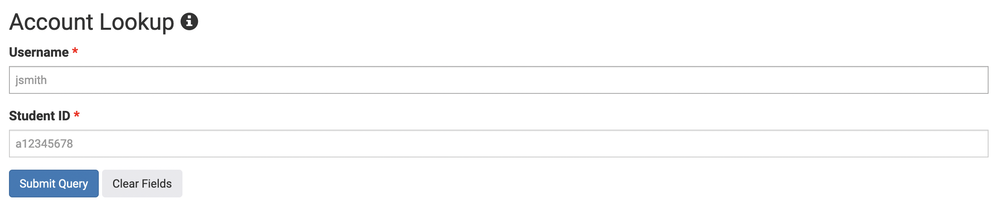
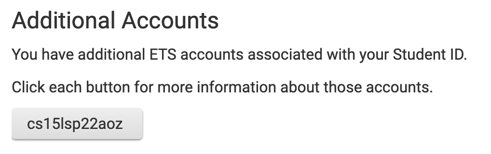
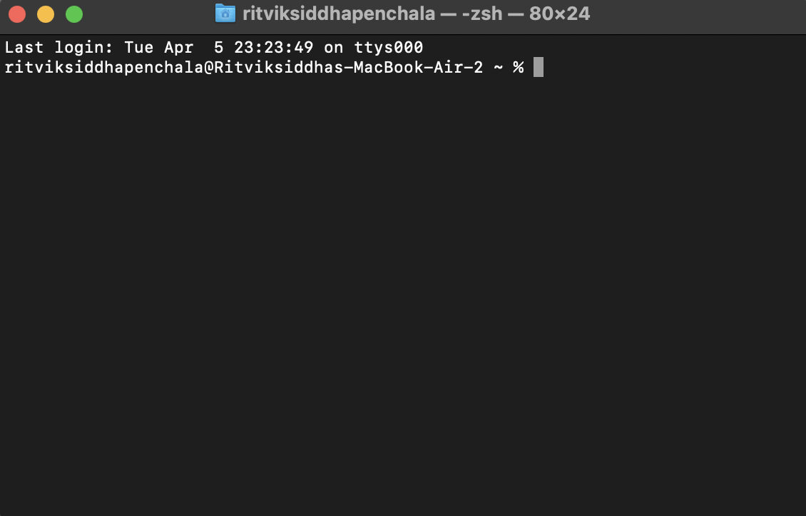
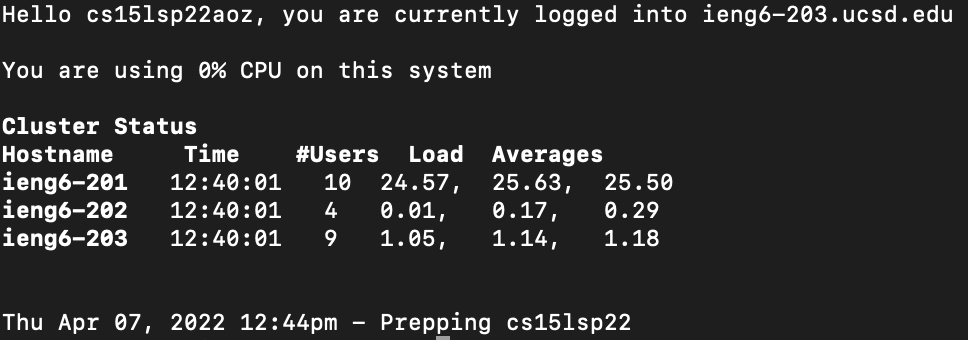

# **Lab Report 1**

___

## Installing VS Code
Visual Studio Code is the text editor we will be using in this class. It is important to have this installed so that you will be able to follow along more easily and have a comfortable environment to write your code in.

1. Go to the [VS Code Website](https://code.visualstudio.com/) and download the VS Code Installer using the button below. 

2. After the download has completed, double-click the executable file in order to run the installer. 

3. Follow the instructions given by the installer in order to set up VS Code. 

4. Once your setup is complete, you should see VS Code pop up looking something like this. 

For now, this is all you need to do. Opening and editing programs on VS Code is fairly easy (just click File>Open), but we will go over the process later, as needed. 

___

## Remotely Connecting
Connecting your personal computer to remote servers is an important part of this class and necessary in order to complete tasks. Here is how you would connect your computer to a server space. 

1. Before you start trying to connect to the server, you need to find your account. Use [This Link](https://sdacs.ucsd.edu/~icc/index.php) to search up your account. 

2. Under Account Lookup, enter your information (your Student AD Login username and your Student ID) and click on the Submit Query Button. 

3. Under the Additional Accounts section, note your account username. Specifically make sure to remember the last 3 characters at the end. 

4. Now, open up your terminal. It should look something like this: 

5. Type `ssh cs15lsp22zz@ieng6.ucsd.edu` into the Terminal. Replace the `zz` in the command with your own username that you found earlier on Account Lookup. After putting in your own username, click enter to run the command. 

6. Once you have ran the ssh command, you will be prompted to enter your password. Type in your password and click enter. 

7. After clicking enter, you should see a screen similar to the following. If you can see this, move on to the next section. 

8. Troubleshooting:  If you are unable to see this, make sure you typed in the `ssh` command, your username, and your password correctly. If this does not work, you may have to go back to [Account Lookup](https://sdacs.ucsd.edu/~icc/index.php) and change your password. 

___

## Trying some Commands
Command Line is a useful tool that is required in order to control actions within the server. Here are some commands that you can use in order to navigate the server's directory and do other cool functions.

1. Now that you are connected to the server, we can try out some commands. Start off by typing in `pwd` in the terminal and clicking enter. 

    Your terminal should look similar to this: 
    ```
    [cs15lsp22aoz@ieng6-203]:~:17$ pwd
    /home/linux/ieng6/cs15lsp22/cs15lsp22aoz
    ```
    `pwd` stands for "Print Working Directory" and does exactly what its name suggests. It prints out the filepath to the directory that we are currently in. 

2. Next, let's try the `ls` command. Once again, type in `ls` into the terminal and click enter. 

    You should see something like this:
    ```
    [cs15lsp22aoz@ieng6-203]:~:18$ ls   
    WhereAmI.class  WhereAmI.java  perl5
    ```
    If you see a different set of files or directories, don't worry about it. The important thing to know is that `ls` is used to list files within the current directory.

3. Before we move on to a different command, try typing in `ls -a` and clicking enter. 

    You should see something like this:
    ```
    [cs15lsp22aoz@ieng6-203]:~:20$ ls -a
    .              .cache   .locallogin     .profile   WhereAmI.class
    ..             .config  .login          .ssh       WhereAmI.java
    .bash_history  .cshrc   .modulesbegenv  .zprofile  perl5
    .bash_profile  .kshrc   .motd           .zshenv
    .bashrc        .local   .procmailrc     .zshrc
    ```
    Despite using the "list files" command again, we can now see way more files and directories than we did previously. This is because `ls -a` is the `ls` command with the `-a` command, which shows us hidden files and directories, unlike the plain `ls` command. 

4. Now, let's try the `mkdir` command. Type `mkdir test` into your terminal. After executing this command, try typing in `ls` again and see if you can find anything new. 

    You should see something like this:
    ```
    [cs15lsp22aoz@ieng6-203]:~:20$ mkdir test
    [cs15lsp22aoz@ieng6-203]:~:21$ ls
    WhereAmI.class  WhereAmI.java  perl5  test
    ```
    Notice that there is a new directory called test in our current directory. This is because the `mkdir` command is used to make a new directory. So when we typed in `mkdir test` we made a new directory called test. 

5. Let's test out the `cd` command now. Before we try it, just use the `pwd` command to see what directory we are currently in. Then, try `cd test` followed by `pwd` again. What do you think happened?

    Your output should look like this:
    ```
    [cs15lsp22aoz@ieng6-203]:~:22$ pwd
    /home/linux/ieng6/cs15lsp22/cs15lsp22aoz
    [cs15lsp22aoz@ieng6-203]:~:23$ cd test
    [cs15lsp22aoz@ieng6-203]:test:24$ pwd
    /home/linux/ieng6/cs15lsp22/cs15lsp22aoz/test
    ```
    According to our `pwd` command we seem to have changed directories and entered the `/test` directory. This is because `cd` is used to change directories. `cd test` was used to change our directory to the `/test` directory. 

6. Try typing in `cd ..` and see what directory you end up in. What do you think the `..` is used to represent?

    Your terminal should look like this:
    ```
    [cs15lsp22aoz@ieng6-203]:test:24$ pwd
    /home/linux/ieng6/cs15lsp22/cs15lsp22aoz/test
    [cs15lsp22aoz@ieng6-203]:test:25$ cd ..
    [cs15lsp22aoz@ieng6-203]:~:26$ pwd
    /home/linux/ieng6/cs15lsp22/cs15lsp22aoz
    ```
    You should see that it looks like we left the `/test` directory and went back to our root directory. This is because the `cd ..` command is used to exit any given directory and go to its parent directory. 

7. Lastly, lets use `rm` to remove a directory. First, type in `ls` to see what directories exist. Then, use `rm -d test` to delete the `/test` directory. Try using `ls` again to see if our directory was successfully deleted. 

    Your terminal should look like this:
    ```
    [cs15lsp22aoz@ieng6-203]:~:27$ ls
    WhereAmI.class  WhereAmI.java  perl5  test
    [cs15lsp22aoz@ieng6-203]:~:28$ rm -d test
    [cs15lsp22aoz@ieng6-203]:~:29$ ls
    WhereAmI.class  WhereAmI.java  perl5
    ```
    The `rm` command is used to remove things. `rm -d` is used to remove directories. We used `rm -d test` in order to tell the computer to remove the specific `/test` directory that we made earlier. 

___

## Moving files with `scp`
`scp` is a useful command that can help us move files from our local system to the server. Using it is necessary in order to transfer important files (such as code) between systems. 

1. Start by creating a simple text file on your local machine. In my case, I created a file called `test.txt`. 

2. Using terminal and the `cd` command, navigate your local machine's directories in order to go to the directory you put the file in. Use the `ls` command to make sure you are in the right place.

    Here is what it should look like at the end:
    ```
    ritviksiddhapenchala@Ritviksiddhas-MacBook-Air-2 test % ls
    test.txt
    ```

3. Now, let's try using the `scp` command to send this file over to our remote server. Type in `scp test.txt cs15lsp22aoz@ieng6.ucsd.edu:~/`. Make sure to use your username and the name of your file. 

    You should see this output:
    ```
    ritviksiddhapenchala@Ritviksiddhas-MacBook-Air-2 test % scp test.txt cs15lsp22aoz@ieng6.ucsd.edu:~/
    test.txt                                      100%   12     1.8KB/s   00:00    

    ```
    You may be prompted to enter your password in order to connect to the remote server. Enter your password if asked to do so. 

4. Let's check to see if our file is actually on the remote system by using `ssh` and `ls` commands. Try to do this on your own. Refer to previous sections if needed. If you need a hint, check out the code below. 

    Here is how I would check to see if the file was on the server:
    ```
    ritviksiddhapenchala@Ritviksiddhas-MacBook-Air-2 test % ssh cs15lsp22aoz@ieng6.ucsd.edu

    Last login: Thu Apr  7 12:44:46 2022 from 100.64.60.239
    quota: No filesystem specified.
    Hello cs15lsp22aoz, you are currently logged into ieng6-203.ucsd.edu

    You are using 0% CPU on this system

    Cluster Status 
    Hostname     Time    #Users  Load  Averages  
    ieng6-201   13:35:02   8  26.90,  25.10,  24.74
    ieng6-202   13:35:01   9  0.46,   0.31,   0.19
    ieng6-203   13:35:01   8  1.48,   1.37,   1.29

    
    Thu Apr 07, 2022  1:35pm - Prepping cs15lsp22
    [cs15lsp22aoz@ieng6-203]:~:31$ ls
    WhereAmI.class  WhereAmI.java  perl5  test.txt
    ```
    
___

## Setting up an SSH Key
Constantly typing in your password in order to connect with your system is annoying. We can create an SSH Key to essentially "register" your personal machine with the server and make sure it no longer requires you to type in your password. 

1. 
___

## Optimizing Remote Running
You might have noticed that, even with the SSH Key, it still takes quite a few commands to even do the most basic tasks. Here are a couple of ways you can optimize this process.

___