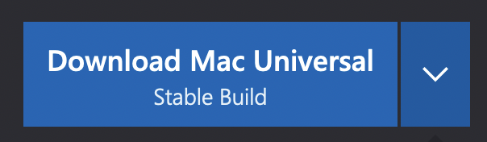

# **Lab Report 1**

___

## Installing VS Code
Visual Studio Code is the text editor we will be using in this class. It is important to have this installed so that you will be able to follow along more easily and have a comfortable environment to write your code in..

 1. Go to the [VS Code Website](https://code.visualstudio.com/) and download the VS Code Installer using the button below. 

 2. After the download has completed, double-click the executable file in order to run the installer. 

 3. Follow the instructions given by the installer in order to set up VS Code. 

 4. Once your setup is complete, you should see VS Code pop up looking something like this. 

___

## Remotely Connecting
This is a way to connect to remote servers using your personal computer 

___

## Trying some Commands

___

## Moving files with `scp`

___

## Setting up an SSH Key

___

## Optimizing Remote Running

___