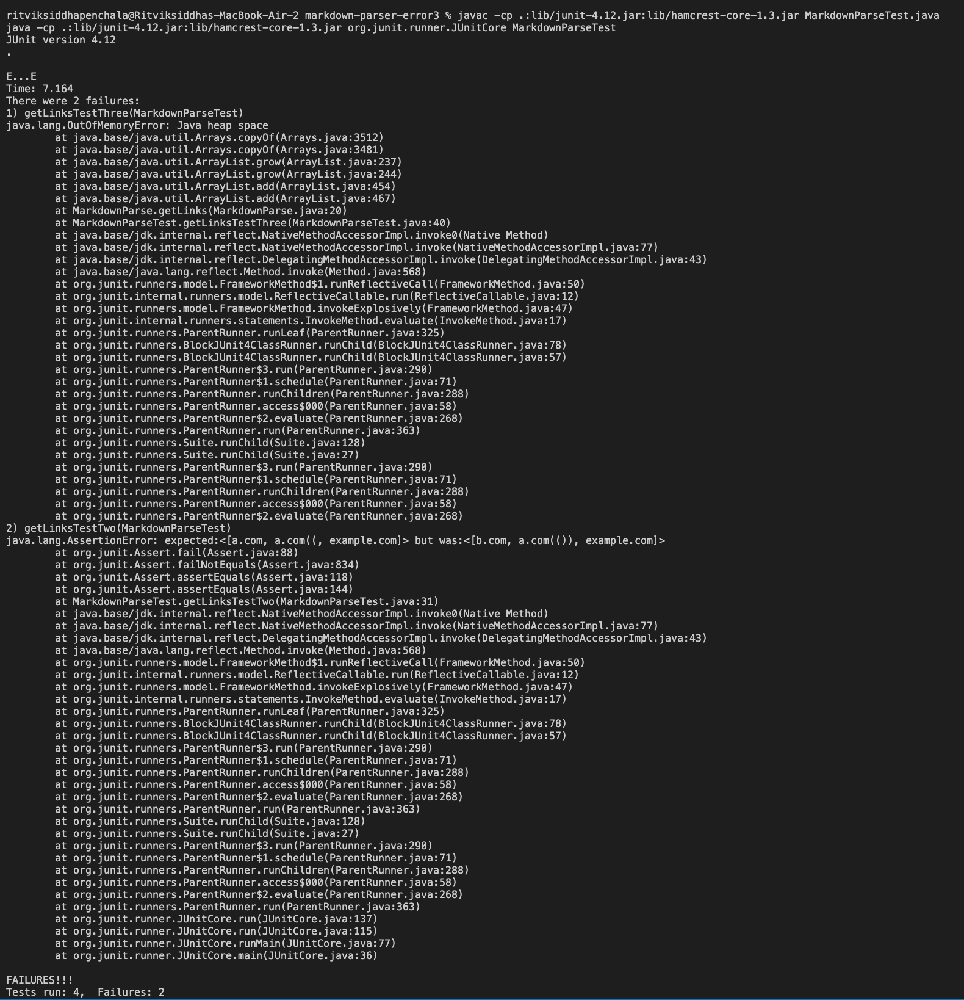

# **Lab Report 4**

___

## Links to Repos

[My repo](https://github.com/ritvikpen/markdown-parser)

[Other repo](https://github.com/aHewig/markdown-parser/tree/61d7e14e5f570ee10983a56363579655be25af0f)

___

## Testing Methods

Here are the tests used for the snippets:

___

## Error Messages

My Error:

Other Error:

___

## Questions

1) My code actually handled this case just fine. I think that since I do not rely on the backtick character in any way, it is just seen as any other, insiginificant alphanumeric character and causes no issues within the code. If there is some kind of an issue though, I would recommend using the parentheses as the identifying features for the URL and simple offsetting those character indices by 1 in order to identify the content within the parentheses and quotation marks. 

2) I don't actually see any short code fix that would account for this. Since my code looks for the first instances of the opening and closing parentheses to identify the contents for the link, adjusting that would be a little difficult. It might be possible to instead identify the last closing parentheses after the first opening parenthesis and the next opening parenthesis or the end of the file. This would be possible, but I think the code change would redo a lot of my current code and be, more or less, starting from scratch. The code for adjusting the indices and fetching the content would remain constant, but that portion of the code is still a pretty minor segment of it. 

3) I think the code fix for this case would actually be pretty straightforward, I'd simply have to remove the new lines before outputting the links I'd found. This would be relying on the expectation that links don't have new lines in them, which is a sound assumption. Removing the `"\n"` instances from the links before outputting them should be sufficient.  