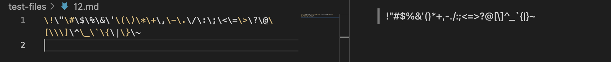
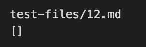
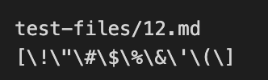
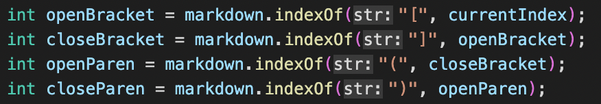
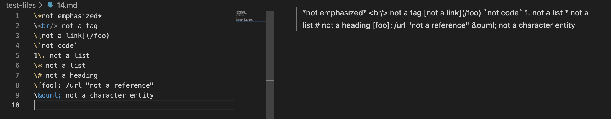
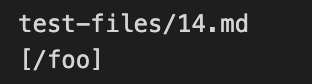
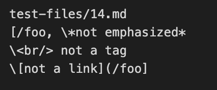
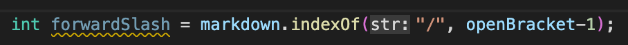
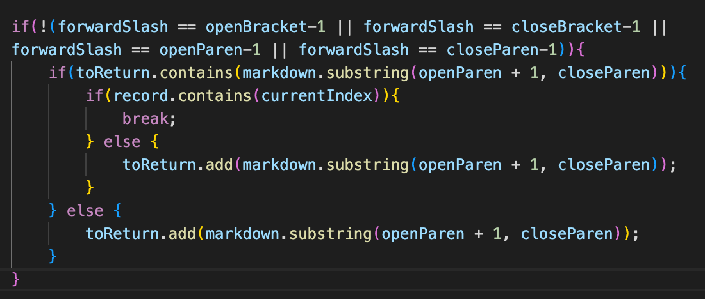

# **Lab Report 5**

___

## Intro Question

I just manually combed through the test files to find a few differences and it was pretty easy to spot. I was going to use vimdiff if I couldn't quickly spot any by just scrolling, but that got the job done. 

___

## Test 12

[Link to Test File](https://github.com/nidhidhamnani/markdown-parser/blob/main/test-files/12.md)

Actual Output (as per preview):

Class Code's Result (ignore line 1 as it is just the filename I stored for convenience):

My Code's Result (ignore line 1 as it is just the filename I stored for convenience):

In this case, we can see that the code given to us in class for Lab 9 was correct and the code made by me and my group was incorrect. The provided code succesfully identified that there were no valid links within the file whereas our code misattributed a region of characters as a link when, in reality, none existed. 

This is because, in my code, we identify the locations of the [] and () characters and simply use their indices to find the text region between the parentheses. In order to account for a situation like this, the indices of the ] and ( characters should be checked to see if they are really right next to one another in order to form a valid link. This is a simple debug, requiring only a conditional check after the indices have been identified. 

We can see the current code's error in this region:

To repair this issue, we would add a conditional check after these variables have been initialized to compare the values of the closeBracket and openParen variables and make sure that they are correctly next to one another.

___

## Test 14

[Link to Test File](https://github.com/nidhidhamnani/markdown-parser/blob/main/test-files/14.md)

Actual Output (as per preview):

Class Code's Result (ignore line 1 as it is just the filename I stored for convenience):

My Code's Result (ignore line 1 as it is just the filename I stored for convenience):

In this case, both the provided code and my group's code was incorrect in identifying the links. The Preview showed us that there were actually no links contained within the .md file so both scripts were incorrect in identifying any links at all. 

In this case, my code's error was due to a lack of recognition of the " \ " character. This character would nullify the the character following it and cause the markdown reader to "skip" over the next character. This means that, in order to repair our code's function, we need to add a variable to store the index of the " \ " character and then compare it to see if it is preceding any of the brackets or parentheses so that we would skip them. A simple implementation might start off by first creating the following variable: 

Then, we would have to compare this index, if it is found, to see if it precedes any of the variables openParen, closePren, openBracket, or closeBracket. 

The above comparison is an excellent start to implementing a full-scale solution. It would only run the code that actually adds the found "link" to the output variable if the forward slash doesn't neighbor any significant characters. We would need to later add code that would account for edge cases, such as wraparound or removing the " / " character from other awkward positions such as a mid-link position, but this will account for many cases in which we would encounter a " / " character. 